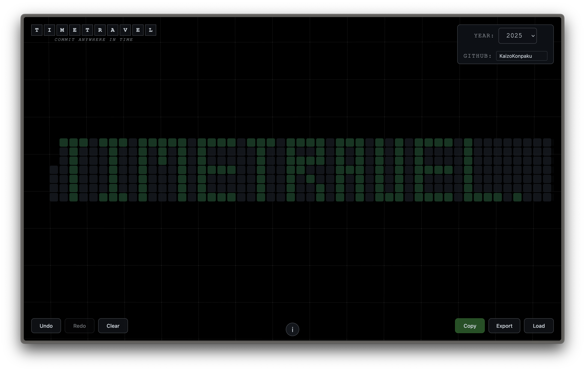

# TimeTravel

A modern web application that helps you create a GitHub-style contribution calendar with custom commit messages. Perfect for tracking activities, habits, or any daily events you want to visualize.




## Features

- 📅 Interactive calendar interface
- ✍️ Custom commit messages for any date
- ⌨️ Keyboard shortcuts for quick navigation
- 💾 Export/Import functionality
- 🔄 Undo/Redo support
- 📱 Responsive design
- 🎨 Modern, clean UI

## Getting Started

1. Clone the repository:
```bash
git clone https://github.com/KaizoKonpaku/TimeTravel.git
cd TimeTravel
```

2. Start a local server (e.g., using Python):
```bash
python -m http.server 8000
```

3. Open your browser and navigate to:
```
http://localhost:8000
```

## Usage

### Basic Navigation
- Use the year selector in the top-right corner to choose a year
- Click on any day to add a commit message
- Click an existing commit to delete it
- Long press on a commit to edit its message

### Keyboard Shortcuts
- **Arrow Keys**: Navigate through the calendar
- **Space**: Toggle commit on selected day
- **Long Press Space**: Open edit modal for selected day
- **Cmd+Enter / Ctrl+Enter**: Save changes in edit modal

### Using Your Commits with Git

1. From TimeTravel app:
   - Select your desired year
   - Click the "Copy" button to copy all Git commands
   - Paste the commands into your terminal
   - Each command will create a commit with your custom message and date

That's it! Your GitHub profile will now show your custom contribution history.

### Export/Import
- Use the "Copy" button to get Git commands for your commits
- Export your commits to a file for backup
- Import commits from a previously exported file

## Contributing

Contributions are welcome! Please feel free to submit a Pull Request.

## License

This project is licensed under the MIT License - see the [LICENSE](LICENSE) file for details.

## Author

- **KaizoKonpaku**
  - GitHub: [@KaizoKonpaku](https://github.com/KaizoKonpaku)
  - Twitter: [@KaizoKonpakuu](https://x.com/KaizoKonpakuu)

## Acknowledgments

- Inspired by GitHub's contribution calendar
- Built with vanilla JavaScript for optimal performance
- Uses modern CSS features for a beautiful UI 